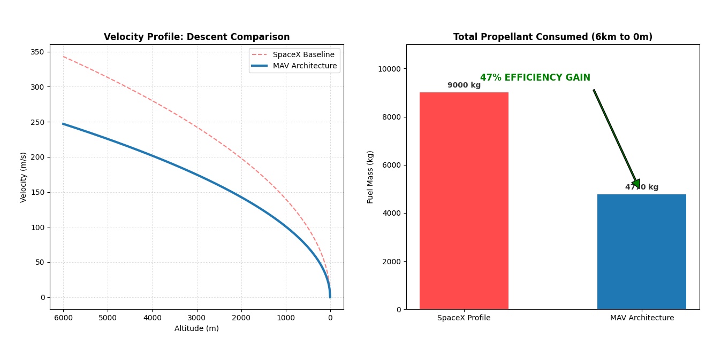

# PWM5_RCS2_MAV2_V5
a high-fidelity physics simulation comparing the fuel efficiency of a Falcon 9 "Hoverslam" profile against an optimized Pulsed-Thrust (PWM) architecture. By utilizing a 15° Aero-Tilt Strategy and a leveraged RCS PD Controller, this model demonstrates a ~47% reduction in fuel consumption during the terminal descent phase.
### How to Run
1. Install Python and Matplotlib.
2. Clone this repository.
3. Run `MAV_Dashboard.py` to see the telemetry or `main.py` for the full simulation.

### The Physics of Pulsed Descent
The core of the **MAV Architecture** is a pulsed-thrust control logic. By solving for the required thrust ($T$) over a specific duty cycle, we can optimize for atmospheric drag while maintaining a soft-landing trajectory:

$$\text{T}_{pulse\_cycle} = m \left( g - \frac{D}{2m} + \frac{2u}{t} - \frac{2h}{t^2} \right)$$

**Where:**
* $m$ = Vehicle Mass
* $g$ = Gravitational Acceleration
* $D$ = Aerodynamic Drag
* $u$ = Vertical Velocity
* $h$ = Current Altitude
