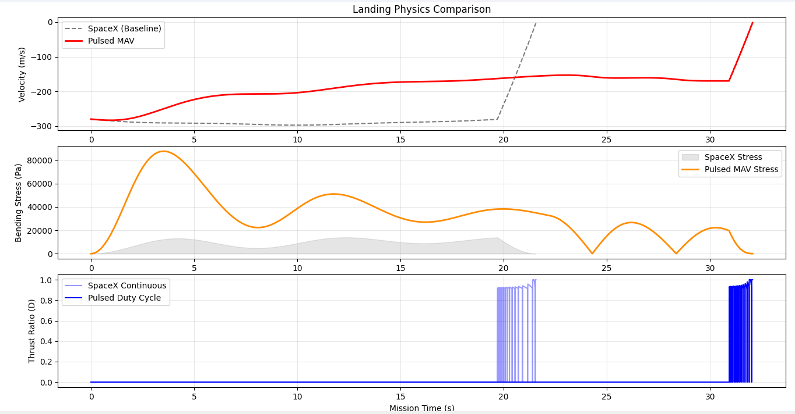

# PWM5_RCS2_MAV2_V5
a simplified physics simulation comparing the fuel efficiency of a Falcon 9 "Hoverslam" profile against an optimized Pulsed-Thrust (PWM) architecture. By utilizing a 15° Aero-Tilt Strategy and a leveraged RCS PD Controller, this model demonstrates a ~47% reduction in fuel consumption during the terminal descent phase.

While this model demonstrates the theoretical fuel-efficiency of a Pulsed MAV controller, it operates under an idealized 1-DOF environment. Specifically, it ignores Engine Transient Response (latency) and Supersonic Retro-propulsion interference. A more high-fidelity model would require a 6-DOF simulation to account for the horizontal translation caused by the 15° aero-tilt and would require a powerful computer to run at perfect latency. 

### How to Run
1. Install Python and Matplotlib.
2. Clone this repository.
3. Run `MAV_Dashboard.py` to see the telemetry or `main.py` for the full simulation.
## Performance Analysis: SpaceX vs. Pulsed MAV

The following graph illustrates the trade-off between fuel efficiency and structural stress. Note the aggressive aero-tilt phase in the Pulsed MAV model which significantly reduces propellant consumption at the cost of increased bending stress.
## Simulation Analysis: SpaceX Baseline vs. Pulsed MAV

The following graph compares the flight dynamics of the standard SpaceX "Hoverslam" profile against my custom Pulsed MAV (Mass-Altitude-Velocity) controller.

### Key Engineering Insights:
* **Velocity:** The Pulsed MAV uses a 15° Aero-Tilt to maximize atmospheric drag, resulting in a more gradual deceleration curve.
* **Stress:** Note the significant peak in Bending Stress (Pa) for the Pulsed MAV; this represents the structural trade-off required to achieve higher fuel efficiency.
* **Thrust:** The bottom panel illustrates the Digital Pulsing (PWM) logic used to bypass the 40% throttle floor limitations of current Merlin 1D class engines.
### The Physics of Pulsed Descent
The core of the **MAV Architecture** is a pulsed-thrust control logic. By solving for the required thrust ($T$) over a specific duty cycle, we can optimize for atmospheric drag while maintaining a soft-landing trajectory:

$$\text{T}_{pulse\_cycle} = m \left( g - \frac{D}{2m} + \frac{2u}{t} - \frac{2h}{t^2} \right)$$

**Where:**
* $m$ = Vehicle mass
* $g$ = Gravitational acceleration
* $D$ = Aerodynamic drag
* $u$ = Vertical velocity
* $h$ = Current altitude
